[](.claude-plugin/marketplace.json)
[](LICENSE)
[](https://github.com/steveaimkt/marketing-team/actions/workflows/verify.yml)


# 마케팅 팀 (marketing-team): 스킬 100개를 갖춘 AI 마케팅 팀

> 마케팅 업무 스킬 100개와 여러 스킬을 잇는 체인 17종을 담았다. 조사, 제품 기획, 콘텐츠, SNS, 광고, 이커머스, 데이터, CRM, 브랜딩, 운영까지 다룬다.
> **AI 마케터**가 일을 받아 직접 하고, 대외로 발행하는 글은 **AI 규제검토자**가, 중요한 판단은 **AI 사업검토자**가 본다. 결과는 전부 **파일로 남는다.**

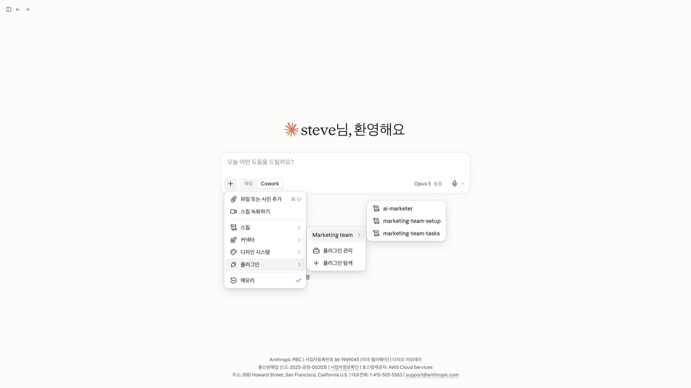

Claude Cowork와 Claude Code에서 쓴다. 한국어 마케팅 실무에 맞춰 만들었다.

## 여기서 시작

처음 설치했다면 → **「마케팅 팀 구축하자」**
무엇을 시킬 수 있는지 보려면 → **「마케팅 팀 업무 리스트 보여줘」**
일을 맡기려면 → **「마케팅 팀 업무 시작하자」**, 또는 바로 「리뷰 분석해줘」
팀 단위로 맡기려면 → **「브랜드 마케팅 팀 업무 시작하자」** (콘텐츠, 퍼포먼스, 그로스도 같다)

번호도 스킬 이름도 외울 필요가 없다. 하고 싶은 일을 평소 말로 하면 알맞은 스킬이 열린다.

## 왜 이 플러그인인가

일반 AI는 글을 준다. 이 플러그인은 **절차와 파일**을 준다.

- **검증된 절차 100개.** 스킬마다 무엇을 읽고, 어디서 멈추고, 무엇을 남기는지 정해져 있다. 같은 요청이면 같은 모양의 결과가 나온다.
- **먼저 계획을 보여 주고 승인을 받는다.** 무엇을 만들지, 어떤 자료로 할지, 어디에 저장할지를 한 화면에 보여 주고 「진행 승인」을 받은 뒤에 실행한다.
- **대외로 발행하는 글은 발행 전에 검사한다.** 광고 카피, 상세페이지, SNS 게시물, 보도자료처럼 대외로 나가는 산출물 32개는 AI 규제검토자가 표시광고법과 업종 법령(화장품법, 건강기능식품법 등) 기준으로 표현을 검사한다.
- **자료가 없어도 멈추지 않는다.** 우리 회사 정보나 데이터가 없으면 가상의 A브랜드 샘플로 끝까지 돌고, 결과에 `[샘플]` 을 붙인다.
- **결과는 파일로 남는다.** `.md`, `.xlsx`, `.csv`, `.docx`, `.pptx`, `.html` 로 작업 폴더에 날짜별로 쌓인다. 무엇을 언제 했는지 실적 원장에도 적힌다.

## 어떻게 움직이나

```
사용자 (모든 ⏸ 승인의 최종 결재권자)
   │
AI 마케터       일을 받고, 계획을 보여 주고, 스킬 100개를 직접 실행한다
   │
   ├─ AI 규제검토자   대외 발행물의 표현 검사 · ⛔ 를 내리면 AI 마케터도 못 뒤집는다
   ├─ AI 사업검토자   경영·재무·고객·법무·브랜드 다섯 관점으로 중요 판단을 본다
   └─ AI 규제세팅     기본 사전에 없는 업종의 「조심할 말 목록」을 만든다
```

| 구성 | 무엇인가 |
|---|---|
| **진입 스킬 3개** | 메뉴에 보이는 스킬이다. `ai-marketer`(일을 받는 입구), `marketing-team-setup`(설치 점검과 회사 정보 등록), `marketing-team-tasks`(할 수 있는 일 목록) |
| **업무 스킬 100개** | 실제 일을 하는 절차다. 메뉴에는 일부러 올리지 않는다. AI 마케터가 명부를 보고 맞는 것을 연다 |
| **체인 17종** | 스킬 여러 개를 한 번에 잇는다. 「시장리서치 돌려줘」 한마디로 키워드 조사부터 가격 조사까지 4단계가 이어진다 |
| **검토자 3명** | 만든 사람이 스스로를 검사하지 않도록 따로 둔 담당이다 |

일은 늘 같은 순서로 돈다. **묻고 → 필요한 자료를 알려 주고 → 계획을 승인받고 → 실행하고 → 보고하고 → 다음 일을 제안한다.**

| | AI 규제검토자 | AI 사업검토자 |
|---|---|---|
| 묻는 것 | **법을 어겼는가** | **사업적으로 맞는가** |
| 대상 | 대외 발행물 32개 | 런칭 플랜, 제안서, 예산안 같은 중요 판단 |
| 예 | 「업계 1위」 실증자료 없음 → ⛔ 나갈 수 없다 | 할인 30%면 마진 8% → 나가도 되지만 팔수록 손해다 |

> AI 규제검토자는 자동 기초 점검이다. 법률 자문을 대신하지 않는다.

## 설치

클로드 **유료 요금제**(Pro, Max, Team, Enterprise)와 **[데스크톱 앱](https://claude.ai/download)**이 필요하다. 설치가 막히면 [설치 영상](https://m.site.naver.com/2f5Qk)을 본다.

### 클로드 코워크 (추천)

1. 입력창의 **「+」 → 「플러그인 추가」 → 「추가」 → 「마켓플레이스 추가」 → 「저장소에서 추가」**
2. URL 에 `steveaimkt/marketing-team` 을 넣고 **「동기화」** (「자동으로 동기화」는 켜 둔다)
3. 목록의 **「Marketing team」 → 「추가」** (로컬 MCP 서버 안내가 뜨면 「계속」)
4. **작업 폴더**를 고르고(입력창 아래 「프로젝트 또는 폴더」 → 「폴더 추가」) 이렇게 입력한다

```
/marketing-team-setup 마케팅 팀 구축하자
```

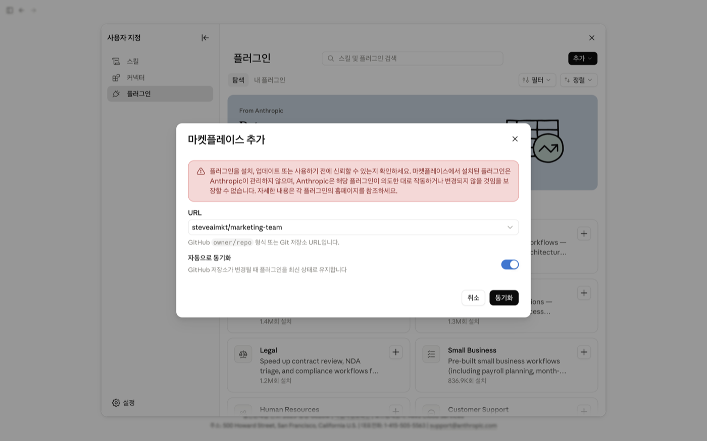

「+」 → 「플러그인」 → 「Marketing team」에 스킬 3개가 보이면 설치된 것이다. 업무 스킬 100개는 목록에 안 보이는 것이 정상이다.


<details>
<summary><strong>화면으로 하나씩 따라 하기</strong> (15장)</summary>

1. 데스크톱 앱 받기 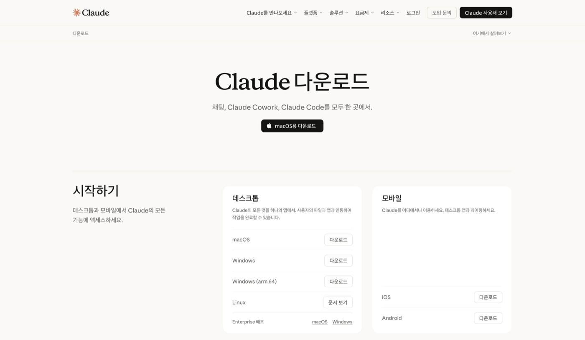
2. 입력창 「+」 → 「플러그인 추가」 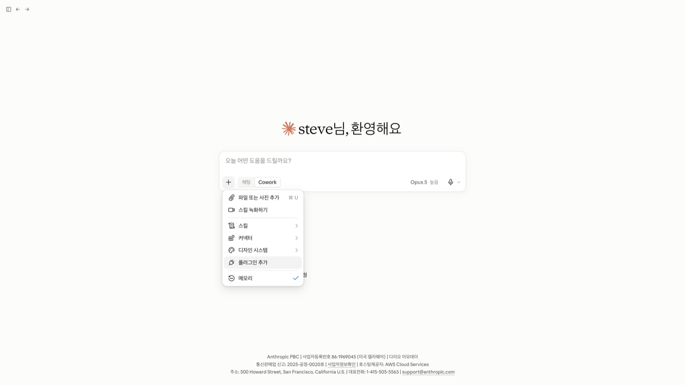
3. 「추가」 → 「마켓플레이스 추가」 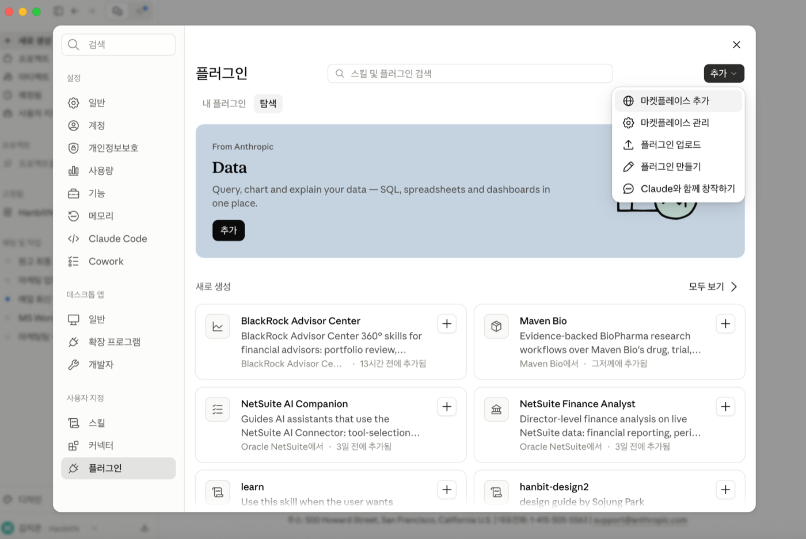
4. 「저장소에서 추가」 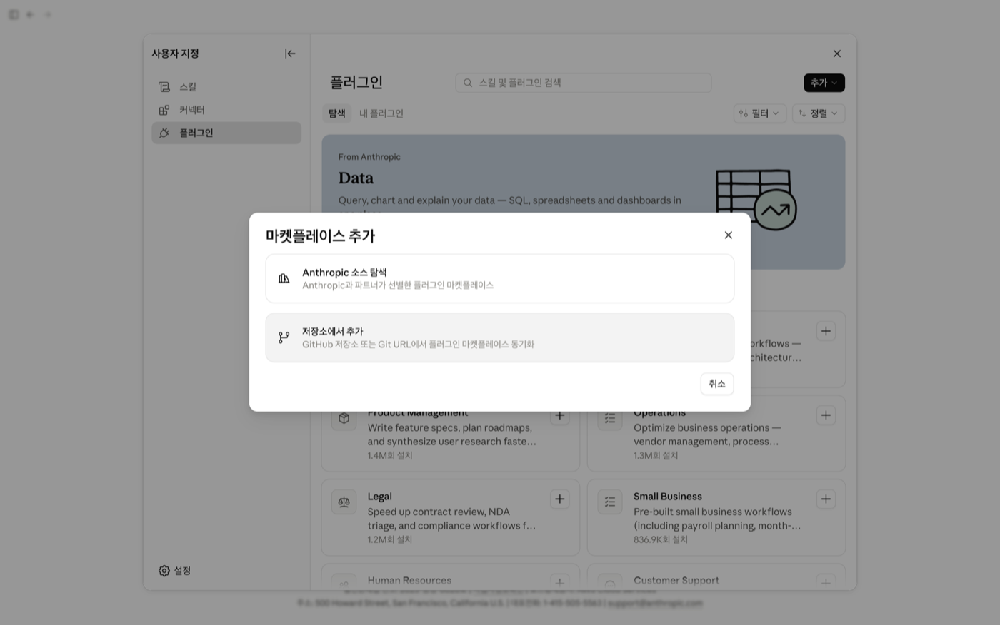
5. `steveaimkt/marketing-team` 넣고 「동기화」 (붉은 안내문은 정상 경고다) 
6. 「Marketing team」 → 「추가」 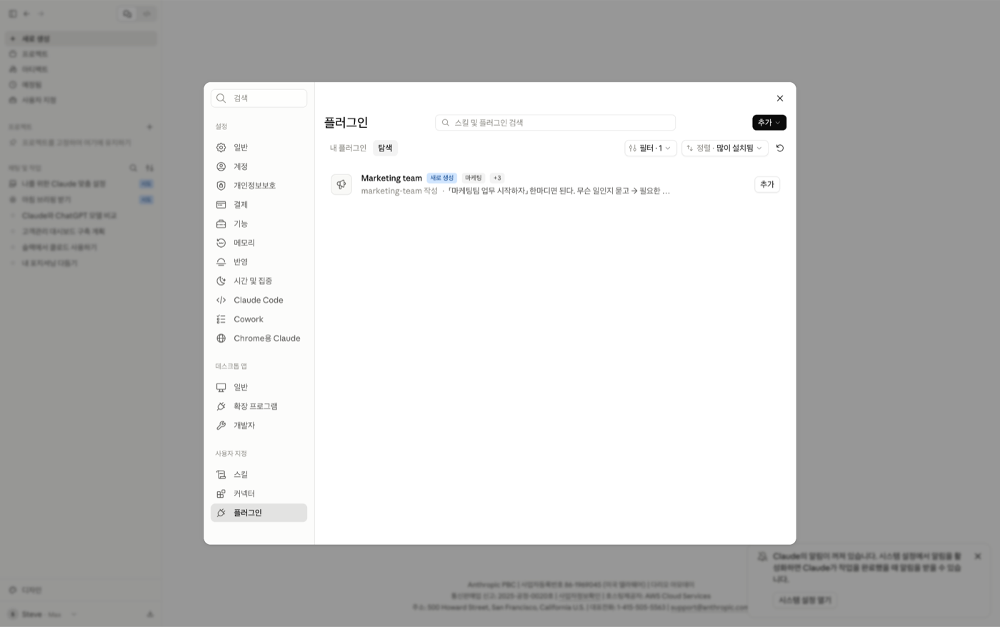
7. 로컬 MCP 서버 안내 → 「계속」 (웹 페이지를 읽는 브라우저 도구다) 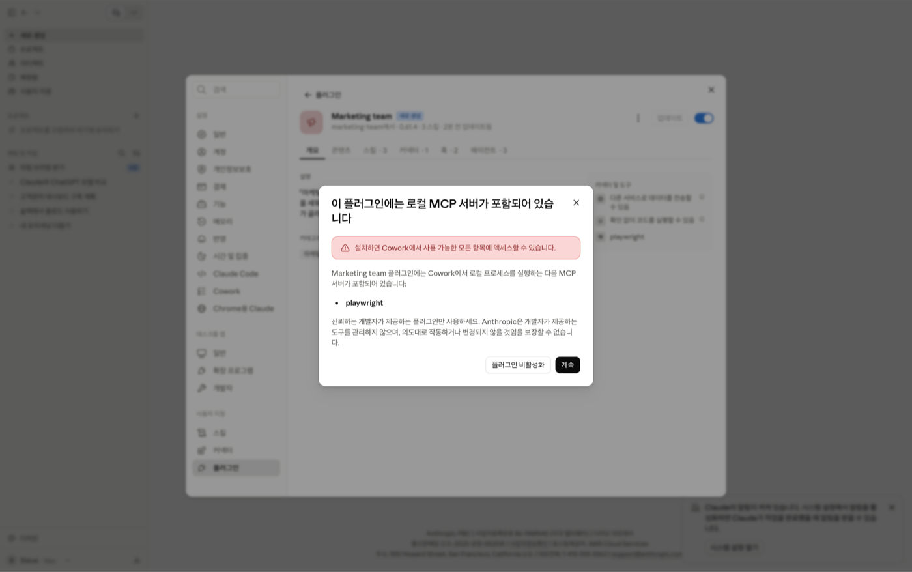
8. 스킬 3개가 보이면 설치 끝 
9. 「프로젝트 또는 폴더」 → 「폴더 추가」 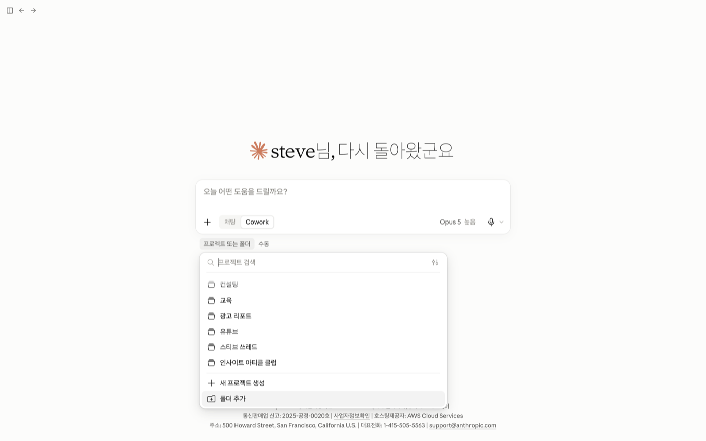
10. `marketing-team` 같은 새 폴더를 만들어 고른다 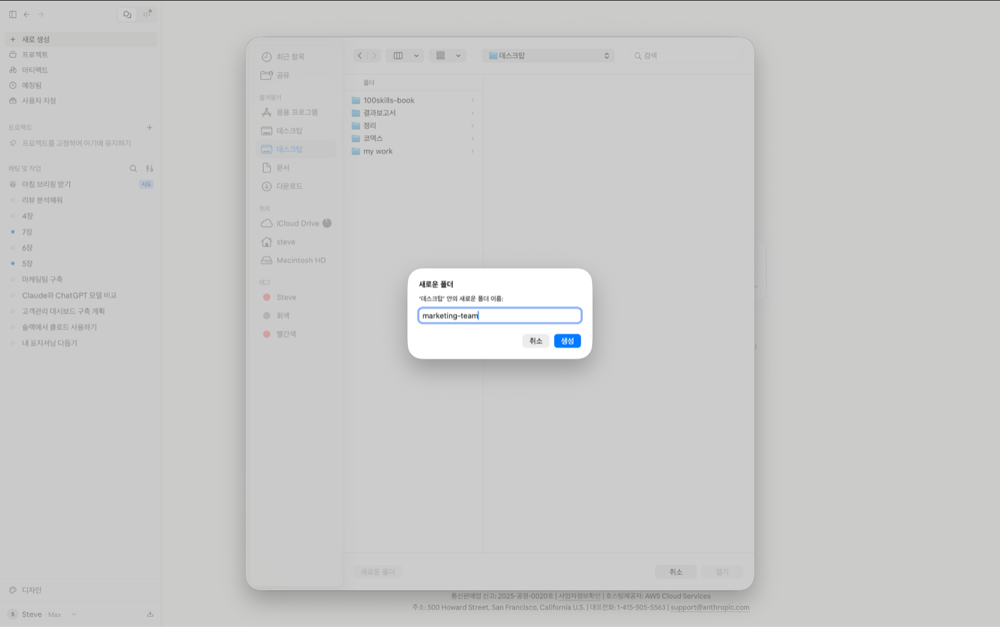
11. `/marketing-team-setup 마케팅 팀 구축하자` 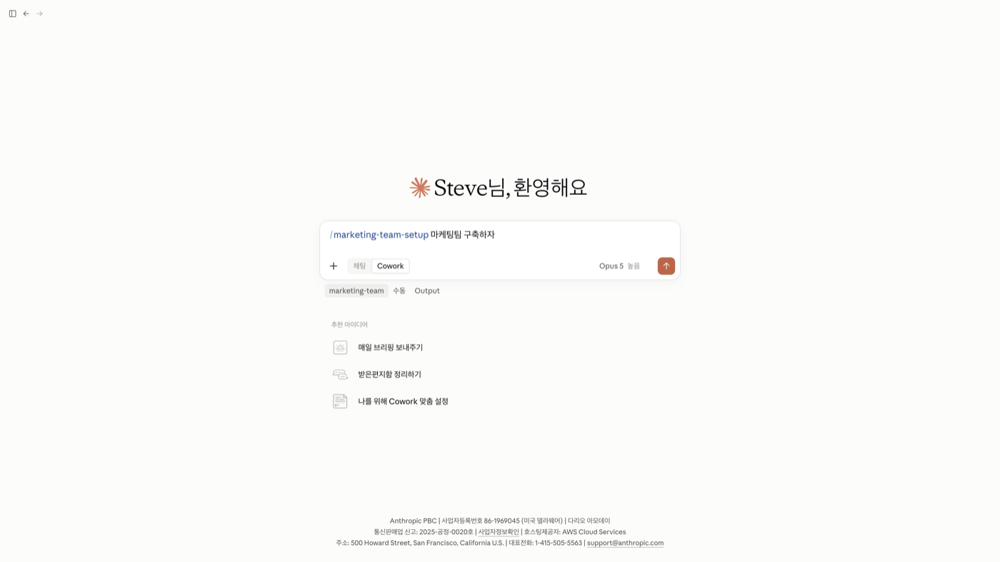
12. 설치 점검 7항목 통과 확인 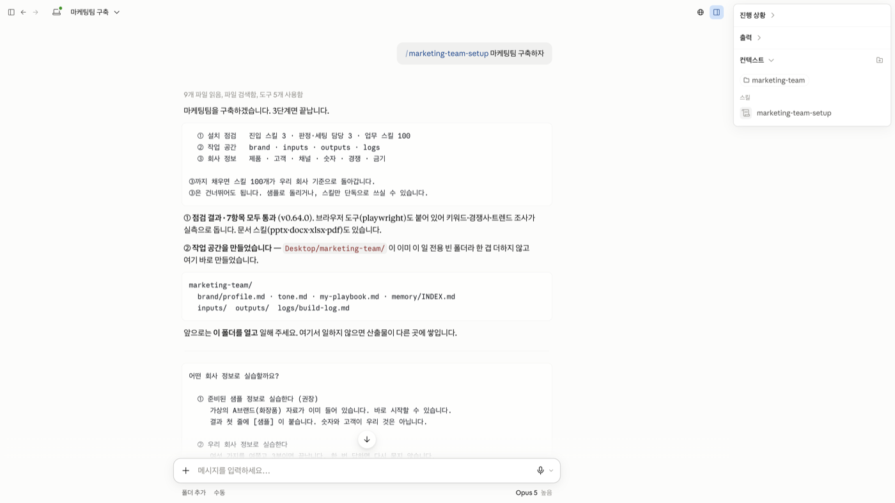
13. 회사 정보 고르기 (샘플로 시작이 권장) 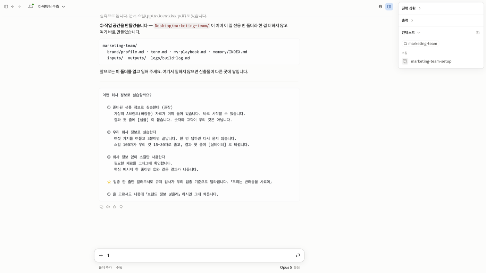
14. 준비 끝 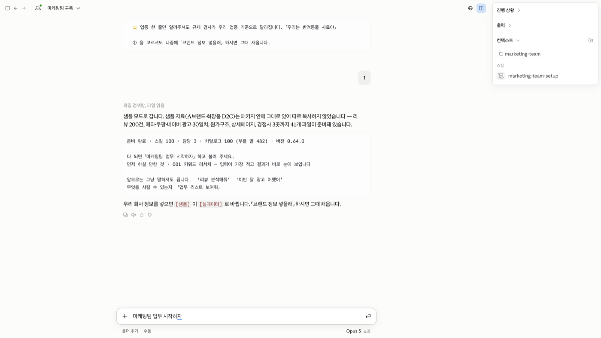
15. 작업 폴더에 brand, inputs, logs, outputs 가 생긴다 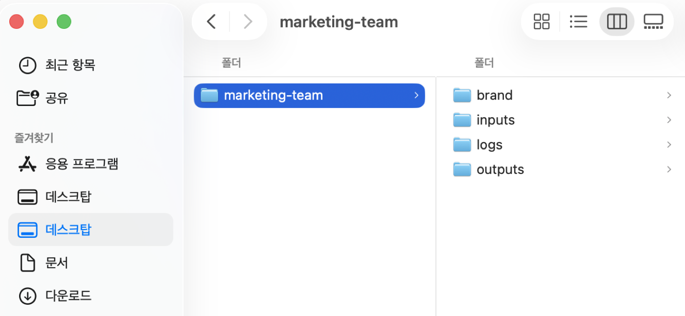

</details>

회사 정보는 **샘플(가상의 A브랜드)로 시작**하면 바로 쓸 수 있다. 나중에 「브랜드 정보 넣을래」라고 하면 우리 회사 정보로 바뀐다. 그다음부터는 **「마케팅 팀 업무 시작하자」** 한마디면 된다.

### 클로드 코드

```bash
claude plugin marketplace add steveaimkt/marketing-team
claude plugin install marketing-team@marketing-team
```

작업 폴더에서 `claude` 를 실행하고 `/marketing-team-setup 마케팅 팀 구축하자` 를 입력한다. 폴더째 여는 방식(고급)은 [CONTRIBUTING.md](CONTRIBUTING.md) 에 있다.

> **업데이트.** 코워크는 「자동으로 동기화」를 켜 두면 새 버전이 알아서 들어온다. 바로 받으려면 마켓플레이스를 동기화하고 플러그인을 업데이트한 뒤 **새 대화를 연다.**

## 할 수 있는 일 100가지

<!-- STATS:START -->
스킬 100 · 부를 말 482 · 게이트 32 · 상태변경 6 · 체인 17
저장 형식 md 56 · xlsx 19 · csv 10 · docx 7 · html 4 · pptx 3 · dir 1 · `writes_to` 보유 100 · 샘플 폴백 64
<!-- STATS:END -->

아래 목록은 스킬 정본에서 자동으로 만든다 (`node plugins/marketing-team/scripts/build-stats.mjs`). 전체 명부는 [100-skills/ROUTING.md](plugins/marketing-team/100-skills/ROUTING.md).

<!-- SKILLS:START -->
<details>
<summary><strong>01 시장조사</strong> (스킬 10개)</summary>

| 번호 | 스킬 | 언제 쓰나 | 이렇게 부른다 |
|---|---|---|---|
| 001 | 키워드 수요 조사 | 콘텐츠·광고에 쓸 검색 키워드를 근거 있는 우선순위로 확정해야 할 때 | 「키워드 조사해줘」 |
| 002 | 경쟁사 분석 | 경쟁 브랜드 2~5개와 자사를 같은 기준으로 비교해 비집고 들어갈 기회 요소를 찾아야 할 때 | 「경쟁사 분석해줘」 |
| 003 | 경쟁사 상시 조사 | 경쟁사 사이트·SNS의 가격·신제품·프로모션 변화를 주기적으로 추적해야 할 때 | 「경쟁사 추적 켜줘」 |
| 004 | 시장 규모 조사 | 사업계획·IR·신규 카테고리 검토에서 시장 규모를 근거 있는 숫자로 제시해야 할 때 | 「시장 크기 알려줘」 |
| 005 | 트렌드 조사 | 카테고리에서 뜨는 시그널과 급상승 키워드를 마케팅 액션으로 연결해야 할 때 | 「트렌드 분석해줘」 |
| 006 | 소비자 리뷰 분석 | 리뷰·댓글·CS 수백 건에서 페인포인트와 개선 신호를 뽑아야 할 때 | 「리뷰 분석해줘」 |
| 007 | 설문 설계 | 고객 조사 설문을 설계하거나 응답 데이터를 세그먼트로 나눠 가설을 결정해야 할 때 | 「고객 설문 만들어줘」 |
| 008 | 고객 유형 정리 | 리뷰·구매·설문 데이터로 타깃 페르소나와 구매 여정을 정의해야 할 때 | 「페르소나 만들어줘」 |
| 009 | 가격 조사 | 경쟁 가격 지형에서 자사 가격의 적정성과 빈 포지션을 확인해야 할 때 | 「경쟁 가격 조사해줘」 |
| 010 | 진입 시장 우선순위 정리 | 진입 후보 시장·채널이 여러 개일 때 무엇부터 들어갈지 순서를 정해야 할 때 | 「어느 시장부터 들어가지?」 |

</details>

<details>
<summary><strong>02 제품기획</strong> (스킬 10개)</summary>

| 번호 | 스킬 | 언제 쓰나 | 이렇게 부른다 |
|---|---|---|---|
| 011 | 신제품 컨셉 기획 | 리서치 자료를 바탕으로 신제품 컨셉을 발산·수렴해 검증 가능한 5안으로 좁혀야 할 때 | 「제품 아이디어 내줘」 |
| 012 | 제품 차별점 정리 | 제품이 누구에게 왜 팔리는지를 한 문장의 가치제안으로 확정해야 할 때 | 「제품 차별점 정리해줘」 |
| 013 | 제품 이름 기획 | 신제품·라인의 이름 후보를 뽑고 상표·도메인 실사까지 준비해야 할 때 | 「제품 이름 지어줘」 |
| 014 | 소싱 상품 분석 | 소싱 후보 상품의 수익성과 시장성을 따져 GO/NO-GO를 결정해야 할 때 | 「이 상품 소싱할까?」 |
| 015 | 제품 강점 정리 | 제품 사양서를 상세페이지·광고에 쓸 고객 언어 셀링포인트로 번역해야 할 때 | 「스펙을 소구점으로 바꿔줘」 |
| 016 | 묶음 상품 설계 | 기획전·행사용 번들을 구성하고 할인 후 남는 마진을 검증해야 할 때 | 「기획전 짜줘」 |
| 017 | 가격 전략 설계 | 신제품 정가를 정하거나 원가·경쟁 변화로 가격을 재설계해야 할 때 | 「가격 어떻게 잡지?」 |
| 018 | 출시 계획 설계 | 신제품 출시를 앞두고 채널별 준비 태스크와 일정·책임을 확정해야 할 때 | 「런칭 플랜 짜줘」 |
| 019 | A/B 테스트 설계 | 카피·가격·소재 가설을 A/B 테스트로 검증하기 전에 설계를 확정해야 할 때 | 「A/B 테스트 설계해줘」 |
| 020 | 제품 개선 우선순위 정리 | 쌓인 개선 요청·VoC를 근거 있는 우선순위 백로그로 정리해야 할 때 | 「제품 개선 우선순위 정해줘」 |

</details>

<details>
<summary><strong>03 콘텐츠</strong> (스킬 10개)</summary>

| 번호 | 스킬 | 언제 쓰나 | 이렇게 부른다 |
|---|---|---|---|
| 021 | 월간 콘텐츠 기획 | 월간·주간 콘텐츠 발행 계획을 채널 믹스와 퍼널 균형까지 잡아 세울 때 | 「콘텐츠 캘린더 짜줘」 |
| 022 | 블로그 글 작성 🛡 | 타깃 키워드로 검색 상위 노출용 블로그 아티클을 완성해야 할 때 | 「블로그 글 써줘」 |
| 023 | 뉴스레터 작성 🛡 | 주제 하나 또는 소스 자료 묶음으로 구독자 뉴스레터 초안을 빠르게 완성할 때 | 「뉴스레터 써줘」 |
| 024 | 유튜브 대본 작성 🛡 | 유튜브 롱폼 대본이 필요할 때, 증거 유무에 따라 형식이 자동으로 나뉜다 | 「유튜브 대본 써줘」 |
| 025 | 유튜브 제목·썸네일 기획 🛡 | 영상 업로드 전 제목·썸네일 A/B 후보를 심리 기제 근거와 함께 뽑을 때 | 「썸네일 제목 뽑아줘」 |
| 026 | 숏폼 대본 작성 🛡 | 롱폼 콘텐츠 하나를 쇼츠·릴스·틱톡 대본 여러 개로 쪼갤 때 | 「쇼츠 대본 만들어줘」 |
| 027 | 콘텐츠 채널별 재작성 🛡 | 완성한 콘텐츠 하나를 여러 채널 문법에 맞춰 시차 전략과 함께 확산할 때 | 「콘텐츠 채널별로 바꿔줘」 |
| 028 | 링크드인 글 작성 🛡 | 리드 유입·인지도 목적의 링크드인 포스트를 발행 직전 수준으로 완성할 때 | 「링크드인 마케팅 글 써줘」 |
| 029 | 스레드 콘텐츠 작성 🛡 | 한 주제를 스레드 5편 연작으로 풀어 팔로우와 대화를 만들 때 | 「스레드 글 써줘」 |
| 030 | 콘텐츠 성과 분석 | 한 달간 발행한 콘텐츠 성과를 회고하고 다음 달 주제를 데이터로 정할 때 | 「콘텐츠 성과 어때?」 |

</details>

<details>
<summary><strong>04 SNS</strong> (스킬 10개)</summary>

| 번호 | 스킬 | 언제 쓰나 | 이렇게 부른다 |
|---|---|---|---|
| 031 | 인스타그램 피드 기획 🛡 | 인스타그램 한 달치 피드를 그리드 무드·캡션·해시태그까지 설계할 때 | 「인스타 피드 기획해줘」 |
| 032 | 댓글·메시지 응대 관리 🛡 | 쌓인 댓글·DM을 분류하고 공개 댓글·DM 이원화 응대 초안을 준비할 때 | 「댓글 답변 도와줘」 |
| 033 | 인플루언서 조사 | 협업할 인플루언서 후보를 발굴하고 진성도·적합도를 검증할 때 | 「인플루언서 찾아줘」 |
| 034 | 인플루언서 협업 설계 🛡 | 선정한 인플루언서에게 보낼 협업 브리프와 계약 체크리스트를 준비할 때 | 「인플루언서 브리프 만들어줘」 |
| 035 | 이벤트 기획 🛡 | 팔로워·UGC·전환 목표의 SNS 이벤트를 필수 고지까지 갖춰 기획할 때 | 「이벤트 기획해줘」 |
| 036 | 커뮤니티 운영 설계 | 디스코드·카페·오픈채팅 커뮤니티를 새로 열거나 구조를 재설계할 때 | 「커뮤니티 만들자」 |
| 037 | 고객 콘텐츠 수집 설계 🛡 | 고객 콘텐츠를 수집해 권리 확보 후 채널·광고 소재로 재활용할 때 | 「고객 콘텐츠 모으자」 |
| 038 | 소셜 언급 분석 | 브랜드 언급량·감성 추이를 주간 단위로 추적하고 부정 급증을 감시할 때 | 「브랜드 언급 분석해줘」 |
| 039 | 채널 성장 진단 | 팔로워·조회수가 정체된 채널의 병목 구간을 찾아 우선 액션을 정할 때 | 「채널 성장이 왜 멈췄어?」 |
| 040 | 바이럴 훅 정리 🛡 | 콘텐츠 도입부 첫 문장·첫 3초를 검증된 훅 패턴으로 뽑을 때 | 「훅 뽑아줘」 |

</details>

<details>
<summary><strong>05 광고</strong> (스킬 10개)</summary>

| 번호 | 스킬 | 언제 쓰나 | 이렇게 부른다 |
|---|---|---|---|
| 041 | 쿠팡 광고 분석 | 주간/월간 쿠팡 광고 성과를 정리하고 예산 조정이 필요할 때 | 「쿠팡 광고 분석」 |
| 042 | 네이버 쇼핑광고 진단 | 네이버 광고 리포트를 받아 어디가 새는지 확인하고 무엇을 끄거나 고칠지 정해야 할 때 (파워링크·쇼핑검색 무관) | 「네이버 광고 봐줘」 |
| 043 | 메타 광고 카피 작성 🛡 | 메타 캠페인에 올릴 A/B 테스트용 카피 세트가 필요할 때 | 「광고 카피 뽑아줘」 |
| 044 | 구글·유튜브 광고 설계 | 구글·유튜브 광고를 처음 세팅하거나 캠페인 구조를 다시 짤 때 | 「구글 광고 세팅 도와줘」 |
| 045 | 광고 주간 성과 분석 | 매주 매체별 광고 성과를 한 장으로 모아 보고해야 할 때 | 「광고 주간 리포트」 |
| 046 | ROAS 진단 | 채널별 성과가 갈려 광고 예산을 어디로 옮길지 결정해야 할 때 | 「예산 다시 짜줘」 |
| 047 | 광고 소재 A/B 분석 | A/B 테스트 결과가 우연인지 확정승인지 결정해야 할 때 | 「A/B 테스트 결과 분석해줘」 |
| 048 | 랜딩페이지 진단 | 광고 클릭은 나오지만 전환이 안 나와 랜딩을 진단해야 할 때 | 「랜딩 전환율 봐줘」 |
| 049 | 광고 심의 진단 | 광고 소재를 매체에 올리기 전 심의·정책 위반 위험을 걸러낼 때 | 「이 광고 문제없어?」 |
| 050 | 유입 경로 추적 설계 | 유입 채널 기여가 뒤섞여 UTM 규칙을 만들고 정리해야 할 때 | 「UTM 정리해줘」 |

</details>

<details>
<summary><strong>06 이커머스</strong> (스킬 10개)</summary>

| 번호 | 스킬 | 언제 쓰나 | 이렇게 부른다 |
|---|---|---|---|
| 051 | 상세페이지 기획 🛡 | 신제품 출시나 리뉴얼로 상세페이지 전체 구조와 카피가 필요할 때 | 「상세페이지 만들어줘」 |
| 052 | 상세페이지 이미지 프롬프트 작성 | 상세페이지 기획서가 확정된 뒤, 이미지 자리를 무엇으로 채울지 정해야 할 때 | 「상세페이지 이미지 프롬프트 만들어줘」 |
| 053 | 상품명 기획 🛡 | 신규 등록이나 노출 부진으로 상품명·태그·카테고리를 다시 세팅할 때 | 「상품명 최적화해줘」 |
| 054 | 리뷰 관리 🛡 | 쌓인 리뷰에 답변을 달고 부정 리뷰 대응이 필요할 때 | 「리뷰 답변 달아줘」 |
| 055 | 스마트스토어 진단 | 스토어 매출이 정체되어 병목이 어디인지 진단해야 할 때 | 「스토어 진단해줘」 |
| 056 | 쿠팡 운영 관리 | 로켓그로스·마켓플레이스 노출, 가격, 발주 시점을 관리해야 할 때 | 「쿠팡 운영 도와줘」 |
| 057 | 프로모션 일정 기획 | 우리가 여는 프로모션의 할인율과 대상 상품을 정하기 전에, 남는 마진율을 먼저 계산할 때 | 「프로모션 캘린더 만들어줘」 |
| 058 | 배송·고객 응대 정책 설계 🛡 | 반품·교환·배송 정책 문구를 새로 만들거나 정비할 때 | 「반품 정책 만들어줘」 |
| 059 | 상품 문의 응대 가이드 🛡 | 상품 페이지 문의가 쌓이고 답이 사람마다 다르거나 늦어서 판매를 놓치고 있을 때 | 「상품 문의 답변 정리해줘」 |
| 060 | 해외 판매 페이지 작성 🛡 | 국내 상세페이지를 해외 마켓용 언어·규격으로 옮겨야 할 때 | 「영문 상세페이지로」 |

</details>

<details>
<summary><strong>07 데이터</strong> (스킬 10개)</summary>

| 번호 | 스킬 | 언제 쓰나 | 이렇게 부른다 |
|---|---|---|---|
| 061 | 판매 데이터 분석 | 매출이 흔들리거나 채널·상품별로 뭐가 팔리는지 뜯어봐야 할 때 | 「매출 데이터 분석해줘」 |
| 062 | 마케팅 대시보드 작성 | 흩어진 채널 지표를 한 화면에서 매일 확인해야 할 때 | 「마케팅 대시보드 만들어줘」 |
| 063 | GA4 유입 분석 | 웹사이트 유입·전환 데이터를 해석하거나 GA4 세팅을 점검할 때 | 「GA4 봐줘」 |
| 064 | 재구매 유지율 분석 | 재구매·잔존율이 궁금하거나 고객이 떨어져나가는 시점을 찾아야 할 때 | 「재구매율 분석해줘」 |
| 065 | 고객 등급 분석 | 고객을 등급·상태별로 나눠 차별화된 캠페인을 보내야 할 때 | 「고객 나눠줘」 |
| 066 | KPI 체계 설계 | 사업 목표를 측정 가능한 지표 체계로 쪼개고 알림 기준을 정해야 할 때 | 「KPI 정해줘」 |
| 067 | 월간 마케팅 성과 분석 | 월말에 전 채널 성과를 한 번에 결산해 경영진에 보고해야 할 때 | 「월간 리포트 만들어줘」 |
| 068 | 데이터 정리 | 분석 전에 지저분한 로우데이터를 신뢰할 수 있는 상태로 만들어야 할 때 | 「마케팅 데이터 정리해줘」 |
| 069 | 성과 예측 분석 | 예산·목표 수립 전에 매출 시나리오와 민감도를 확인해야 할 때 | 「매출 시나리오 돌려줘」 |
| 070 | 설문 응답 분석 | 설문·NPS 응답이 쌓였지만 주관식을 읽을 엄두가 안 날 때 | 「설문 결과 분석해줘」 |

</details>

<details>
<summary><strong>08 CRM</strong> (스킬 10개)</summary>

| 번호 | 스킬 | 언제 쓰나 | 이렇게 부른다 |
|---|---|---|---|
| 071 | 고객 응대 챗봇 설계 | 반복 문의를 자동응대로 돌려 상담 리소스를 줄이고 싶을 때 | 「CS 봇 만들자」 |
| 072 | 고객 응대 매뉴얼 작성 | 반복 문의·리뷰 응대를 표준 스크립트로 통일해야 할 때 | 「CS 매뉴얼 만들어줘」 |
| 073 | 고객 여정 정리 | 고객이 어디서 이탈하는지 터치포인트 전체를 조망해야 할 때 | 「고객 여정 그려줘」 |
| 074 | 이메일 발송 설계 🛡 | 웰컴·장바구니·재구매 등 트리거 기반 메일 흐름을 설계·발송할 때 | 「이메일 시퀀스 짜줘」 |
| 075 | 카카오 알림 설계 🛡 | 카카오 알림톡과 브랜드 메시지 템플릿을 만들거나 심사 통과가 필요할 때 | 「알림톡 만들어줘」 |
| 076 | 멤버십 등급 설계 | 고객 등급제·멤버십 혜택 구조를 수익성 있게 설계해야 할 때 | 「멤버십 만들자」 |
| 077 | 이탈 고객 되찾기 기획 🛡 | 휴면·이탈 고객을 다시 불러오는 캠페인을 설계해야 할 때 | 「휴면 고객 깨워줘」 |
| 078 | 고객 의견 정리 | 채널마다 흩어진 고객 소리를 한 체계로 모아 개선 과제로 이어야 할 때 | 「VoC 정리해줘」 |
| 079 | 리뷰 요청 설계 🛡 | 구매 고객에게 적절한 시점에 후기 요청을 자동으로 보내고 싶을 때 | 「리뷰 요청 보내자」 |
| 080 | 고객 인터뷰 설계 | 고객이 왜 사는지 직접 물어볼 질문지를 만들거나 녹취를 요약할 때 | 「고객 인터뷰 준비해줘」 |

</details>

<details>
<summary><strong>09 브랜딩·세일즈</strong> (스킬 10개)</summary>

| 번호 | 스킬 | 언제 쓰나 | 이렇게 부른다 |
|---|---|---|---|
| 081 | 브랜드 스토리 작성 | 브랜드의 존재 이유를 스토리와 미션 문장으로 처음 정리하거나 다시 세울 때 | 「브랜드 스토리 만들어줘」 |
| 082 | 브랜드 가이드 작성 | 로고·컬러·톤 사용 기준을 외주와 팀 공유용 문서로 정리해야 할 때 | 「브랜드 가이드 정리해줘」 |
| 083 | 보도자료 작성 🛡 | 출시·성과·제휴 소식을 언론 배포용 보도자료로 만들 때 | 「보도자료 써줘」 |
| 084 | 제안서 작성 🛡 | 고객 문의나 RFP가 들어와 맞춤 제안서를 발표 파일까지 만들어야 할 때 | 「제안서 써줘」 |
| 085 | 영업 발표자료 작성 🛡 | 고객 미팅이나 피칭용 발표 덱을 구조부터 카피까지 짜야 할 때 | 「피치덱 만들어줘」 |
| 086 | 회의 결과 정리 | 고객 미팅 직후 요약·할 일·팔로업 메일을 한 번에 정리할 때 | 「미팅 노트 정리해줘」 |
| 087 | 제휴 제안서 작성 🛡 | 타 브랜드와 콜라보·제휴를 제안할 딜 구조와 문서가 필요할 때 | 「제휴 제안하자」 |
| 088 | 협찬 콘텐츠 기획 🛡 | 광고주 브리프를 받아 협찬·브랜디드 콘텐츠 기획안을 만들 때 | 「협찬 콘텐츠 기획해줘」 |
| 089 | 위기 대응 설계 🛡 | 부정 이슈가 확산 중이라 대응 여부와 문구를 급히 결정해야 할 때 | 「이슈 터졌어 어떡해」 |
| 090 | 수상·인증 지원서 작성 🛡 | 지원사업·어워드·인증 공고에 맞춰 지원서를 작성할 때 | 「지원사업 서류 써줘」 |

</details>

<details>
<summary><strong>10 운영</strong> (스킬 10개)</summary>

| 번호 | 스킬 | 언제 쓰나 | 이렇게 부른다 |
|---|---|---|---|
| 091 | 마케팅 업무 진단 | 개인 마케팅 에이전트를 만들기 전 무엇부터 자동화할지 업무를 진단할 때 | 「뭐부터 자동화하지?」 |
| 092 | 나만의 스킬 만들기 | 반복 업무를 재사용 가능한 SKILL.md로 만들어 등록하고 싶을 때 | 「스킬 만들어줘」 |
| 093 | 회의록 정리 | 회의 직후 결정 사항과 태스크·미결 사항을 실행 항목 표로 정리할 때 | 「회의록 정리하고 업무 나눠줘」 |
| 094 | 외주 요청서 작성 | 디자인·영상·개발 외주를 맡기기 전 요구사항을 브리프로 정리할 때 | 「외주 브리프 만들어줘」 |
| 095 | 마케팅 예산 설계 | 분기·월별 마케팅 예산을 채널별로 배분하고 계획할 때 | 「예산 짜줘」 |
| 096 | 견적 비교 분석 | 외주·입찰 견적서 여러 건을 받아 비교하고 검증해야 할 때 | 「견적 비교해줘」 |
| 097 | 팀 업무 매뉴얼 작성 | 신규 입사·퇴사·업무 이관 전에 업무 매뉴얼을 표준화할 때 | 「인수인계 문서 만들어줘」 |
| 098 | 주간 업무 정리 | 한 주를 마감하며 회고와 다음 주 우선순위를 세울 때 | 「이번 주 마케팅 회고하자」 |
| 099 | 법무 기초 진단 | 이벤트·광고·수집 양식을 공개하기 전 법적 리스크를 점검할 때 | 「이 문구 법적으로 문제없어?」 |
| 100 | 나만의 에이전트 만들기 | 보유 스킬을 내 업무에 배선하고 주간 루틴·승인 정책을 정할 때 | 「내 업무에 맞게 배선해줘」 |

</details>

<details>
<summary><strong>체인 17종</strong> (스킬 여러 개를 한 번에 잇는다)</summary>

| 체인 | 무엇을 잇나 | 이렇게 부른다 |
|---|---|---|
| **시장리서치** | 키워드 수요 조사 → 경쟁사 분석 → 소비자 리뷰 분석 → 가격 조사 | 「시장리서치 돌려줘」 |
| **신제품런칭** | 신제품 컨셉 기획 → 제품 차별점 정리 → 가격 전략 설계 → 출시 계획 설계 | 「신제품런칭 돌려줘」 |
| **콘텐츠프로덕션** | 월간 콘텐츠 기획 → 블로그 글 작성 또는 유튜브 대본 작성 → 콘텐츠 채널별 재작성 → 콘텐츠 성과 분석 | 「콘텐츠프로덕션 돌려줘」 |
| **소셜그로스** | 채널 성장 진단 → 인스타그램 피드 기획 → 바이럴 훅 정리 → 이벤트 기획 | 「소셜그로스 돌려줘」 |
| **광고애널리틱스** | 광고 주간 성과 분석 → ROAS 진단 → 메타 광고 카피 작성 | 「광고애널리틱스 돌려줘」 |
| **스토어셋업** | 상품명 기획 → 상세페이지 기획 → 상세페이지 이미지 프롬프트 작성 → 배송·고객 응대 정책 설계 | 「스토어셋업 돌려줘」 |
| **월간리포트** | 데이터 정리 → 판매 데이터 분석 → 월간 마케팅 성과 분석 → KPI 체계 설계 | 「월간리포트 돌려줘」 |
| **리텐션캠페인** | 재구매 유지율 분석 → 고객 등급 분석 → 고객 여정 정리 → 카카오 알림 설계 → 이탈 고객 되찾기 기획 | 「리텐션캠페인 돌려줘」 |
| **세일즈파이프라인** | 회의 결과 정리 → 제안서 작성 → 영업 발표자료 작성 → 제휴 제안서 작성 | 「세일즈파이프라인 돌려줘」 |
| **마케팅에이전트셋업** | 마케팅 업무 진단 → 나만의 스킬 만들기 → 나만의 에이전트 만들기 | 「마케팅에이전트셋업 돌려줘」 |
| **VoC애널리틱스** | 소비자 리뷰 분석 → 고객 의견 정리 → 제품 개선 우선순위 정리 → 리뷰 관리 | 「VoC애널리틱스 돌려줘」 |
| **브랜드셋업** | 브랜드 스토리 작성 → 브랜드 가이드 작성 → 고객 유형 정리 → 제품 차별점 정리 | 「브랜드셋업 돌려줘」 |
| **브랜드마케팅팀** | 제품 강점 정리 → 상품명 기획 → 상세페이지 기획 → 상세페이지 이미지 프롬프트 작성 | 「브랜드마케팅팀 돌려줘」 |
| **콘텐츠마케팅팀** | 채널 성장 진단 → 월간 콘텐츠 기획 → 인스타그램 피드 기획 → 바이럴 훅 정리 | 「콘텐츠마케팅팀 돌려줘」 |
| **유튜브프로덕션** | 트렌드 조사 → 유튜브 대본 작성 → 유튜브 제목·썸네일 기획 → 숏폼 대본 작성 | 「유튜브프로덕션 돌려줘」 |
| **인플루언서캠페인** | 인플루언서 조사 → 인플루언서 협업 설계 → 고객 콘텐츠 수집 설계 → 콘텐츠 채널별 재작성 | 「인플루언서캠페인 돌려줘」 |
| **위기커뮤니케이션** | 소셜 언급 분석 → 위기 대응 설계 → 댓글·메시지 응대 관리 → 보도자료 작성 | 「위기커뮤니케이션 돌려줘」 |

</details>

🛡 는 발행 전에 AI 규제검토자가 표현을 검사하는 스킬이다 (32개).
<!-- SKILLS:END -->

스킬 이름은 「무엇을 + 어떻게」 형식이다. 끝말이 여덟 가지(조사, 분석, 진단, 기획, 작성, 설계, 정리, 관리)뿐이라 목록을 훑을 때 종류가 바로 구분된다.
`ROAS`, `SEO`, `GA4`, `KPI` 처럼 마케터가 쓰는 말은 그대로 두고, 업계 은어만 풀었다. 대조표는 [docs/스킬명-대조표.md](plugins/marketing-team/docs/스킬명-대조표.md).

## 함께 쓰면 좋은 것

| 도구 | 무엇이 달라지나 | 없으면 |
|---|---|---|
| **브라우저 도구** (`@playwright/mcp`, 플러그인과 함께 온다) | 키워드 조사, 경쟁사 조사, 트렌드 조사, 소셜 언급 분석이 공개 웹 페이지를 직접 읽는다 | 자료를 손으로 받는 방식으로 그대로 돈다 |
| **앤트로픽 공식 문서 스킬** (`document-skills`) | 제안서와 발표자료를 `.pptx`, `.docx`, `.xlsx` 로 받고, PDF와 워드 자료도 읽는다 | 표는 `.csv`, 문서는 `.md` 로 내고 그렇게 알려 준다 |

```
/plugin marketplace add anthropics/skills
/plugin install document-skills@anthropic-agent-skills
```

⚠️ 한글(HWP) 파일은 읽지 못한다. PDF나 워드로 저장해서 넣는다.

## 설치하면 내 컴퓨터에 무엇이 생기나

**제품과 내 데이터는 다른 곳에 따로 생긴다.** 이것을 헷갈리면 결과물을 못 찾는다.

| | 제품 | 작업 폴더 |
|---|---|---|
| 누가 만드나 | 플러그인 설치가 | 「마케팅 팀 구축하자」가 |
| 어디에 | 클로드가 정한 곳 | **내가 고른 폴더** |
| 몇 개 | 하나 | **여러 개** (브랜드나 프로젝트마다 따로 둘 수 있다) |
| 업데이트하면 | 새것으로 바뀐다 | 그대로 남는다 |

```
{내가 고른 폴더}/
  brand/     profile.md · tone.md · my-playbook.md · memory/ (쌓이는 앎)
  inputs/    내 파일을 넣어 두는 곳 (CSV, 화면 캡처)
  outputs/   결과물이 날짜별로 쌓이는 곳
  logs/      build-log.md (실적 원장)
```

⚠️ 작업 폴더를 여러 개 두면 결과물도 나뉘어 쌓인다. 「어제 만든 게 없다」의 대부분은 **다른 폴더를 열고 있는 것**이다.

## 만든 사람

[WMBB](https://github.com/steveaimkt)의 한성국이 만들었다. 『퇴근을 앞당기는 AI 마케팅 자동화』의 실습 플러그인이다.

## 기여

스킬을 고치거나 검사를 돌리려면 [CONTRIBUTING.md](CONTRIBUTING.md) 를 본다.

## 라이선스

MIT. [LICENSE](LICENSE) 를 본다.
